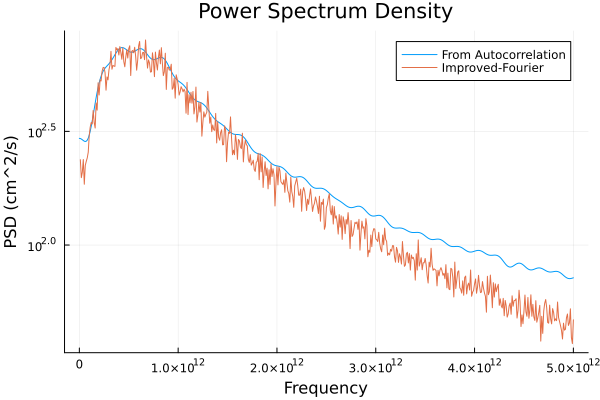

# Evaluación Contínua FísComp 1 - Teorema de Wiener-Khinchin
#### Por Gabriel D'Andrade Furlanetto XDD204950 y Álvaro Gamarra Ralero 04231602Q

## Análisis de la función autocorrelación de $t=0ps$ hasta $t=5ps$

Tenemos que en este intervalo de tiempo, las velocidades están distribuidas segundo:

Y que la autocorrelación es:

----

## Cálculo de la PSD usando el teorema de Wiener-Kinchin
Tomamos la transformada de Fourier de la función de autocorrelación y obtenemos que la PSD es:

*En virtud del teorema de muestreo de Nyquist‐Shannon ¿hasta qué frecuencia, Bmax, en GHz podría calcular la densidad espectral SXX(f)?*

El teorema de mostreo de Shannon nos dice que la frecuencia máxima que podemos obtener con una transformada de Fourier es:

$$B_{max} = \frac{f_s}{2} = \frac{1}{2t_s}$$

De manera que, como tenemos un mostreo de $t_s = 10 fs$, se puede obtener una frecuencia máxima de 

$$  B_{max} = \frac{1}{20 fs} = 0.05 10^{15} Hz= 5 10^{4} GHz = 50 THz $$

----

## Cálculo de la PSD directamente de la Transformada de Fourier

### Transformada de Fourier "directa"

Si tomamos la transformada de Fourier directamente de los $N=10^4$ y $N=10^6$ datos, tendremos el siguiente resultado:

Que, como comentado en las preguntas, es extremadamente ruidoso.

----

### Transformada de Fourier "por partes"

Cuando hacemos la transformada de Fourier descrita en la hoja de problemas, tomando $N_b=100$ intervalos de tamaño $10^4$, nos sale mucho mejor la convergencia de los dos métodos, pero sí que son distintos a altas frecuencias:

Lo que suponemos que es un artefacto de que todavía no tenemos un intervalo suficientemente grande para la transformada de Fourier.

*Comenta, a raíz de los resultados anteriores, con tus propias palabras la relevancia del teorema de Wiener‐Khinchin (WK) para estudiar procesos aleatorios de magnitudes físicas.*

A vista de los resultados anteriores, el teorema de WK nos da una herramienta poderosa para encontrar una PSD de un proceso estocástico de manera mucho más eficiente que el cálculo directo y que converge con una cantidad razonable de datos. Obviamente, el problema de convergencia de la transformada directa sería amenizado utilizando un esquema de FFT usual de alguna librería, pero no habría ninguna razón para hacerlo, ya que podemos también hacer la FFT de la autocorrelación y quedarnos mucho más tranquilos con los resultados.

----

## Dependencia de la movilidad con dopaje y temperatura

Ajksdgh